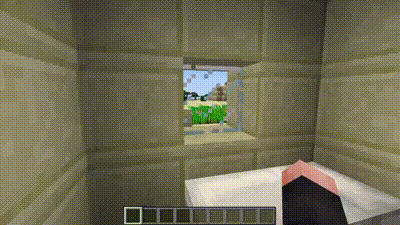

# ⏰ RealTime

Syncronize real time with Minecraft time.



## Building

If you want to build the project by yourself just run

```bash
git clone https://github.com/NienteSpigotSenzaJava/RealTime
cd RealTime
mvn clean package
```

you will find ```RealTime-1.0.0.jar``` in the ```/target``` directory.

## Usage

The plugin has one command which is ```/rtime``` (also ```/rt``` or ```/realtime```), below you can find a list of usages for the command

| Argument                      | Usage                                        |
|-------------------------------|----------------------------------------------|
| ```/rtime activate```            | Activate the plugin                          |
| ```/rtime deactivate```          | Deactivate the plugin                        |
| ```/rtime timezone```            | Get the actual timezone                      |
| ```/rtime timezone <timezone>``` | Change the actual timezone                   |
| ```/rtime time```                | Get the actual time in the selected timezone |

## Compatibility

The plugin should work from version ```1.13.2``` to version ```1.19.4```, for any problem just open an issue.

## Contributing

Pull requests and issues are welcome. I obviously accept any constructive criticism.

## License

[MIT](https://choosealicense.com/licenses/mit/)
